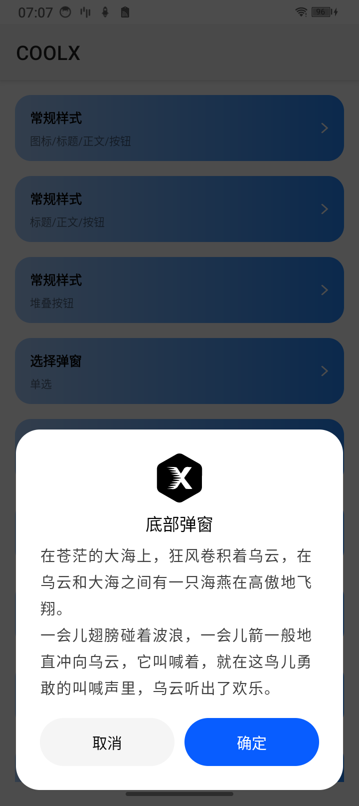
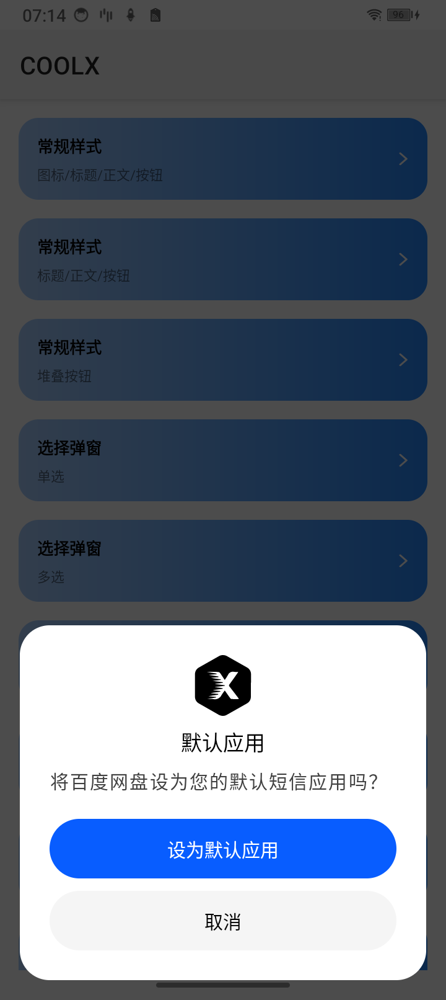
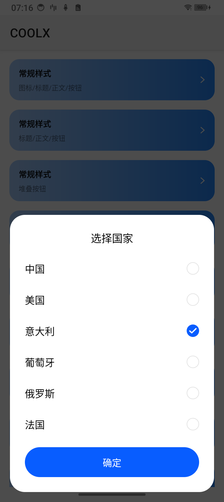
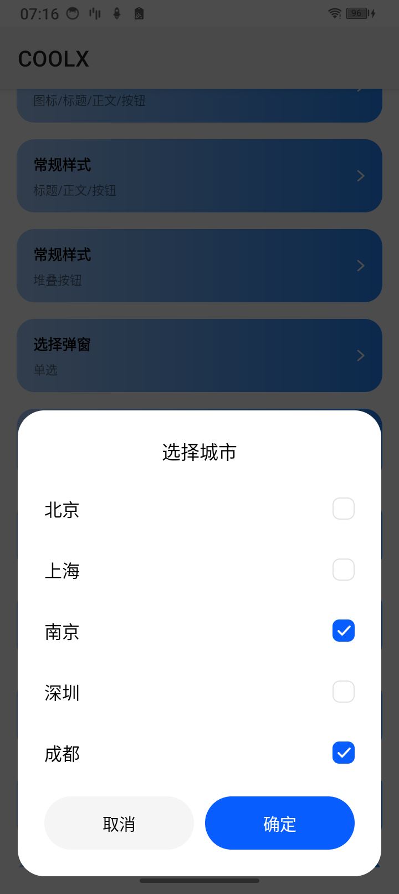
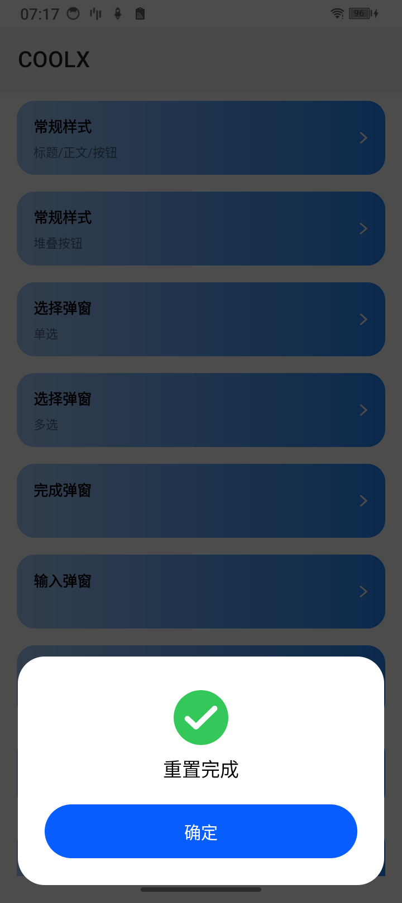
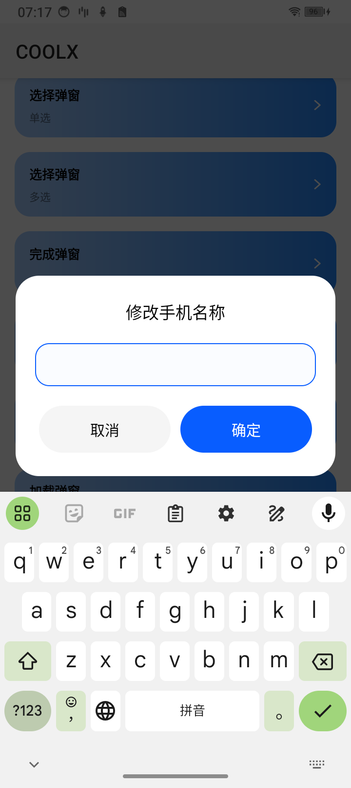

# COOLX


## Implementation

集成 CoolX 之前，请先将项目更新到 AndroidX 库，如项目使用库较老，请迁移至 [AndroidX](https://developer.android.google.cn/jetpack/androidx/migrate?hl=zh-cn)。


1. 项目目录下<br>
   build.gradle.kts 添加：

```kts
implementation 'com.github.pepsimaxin:coolx:0.0.1'
```

2. 工程目录下<br>
   settings.gradle.kts 添加：

```kts
dependencyResolutionManagement {
    repositoriesMode.set(RepositoriesMode.FAIL_ON_PROJECT_REPOS)
    repositories {
        ...
        maven { url = uri("https://jitpack.io") }
    }
}
```

## Tips

✅ 项目中实现 CoolX AlertDialog 效果，只需要「 配置主题 」及「 替换包名 」即可！

1. 配置主题

```xml
<!-- 你的 APP 主题. -->
<style name="Base.Theme.Coolx" parent="Theme.AppCompat.DayNight">
    <!-- 全局替换 AlertDialog 主题 -->
    <item name="alertDialogTheme">@style/CoolX.AlertDialog.Theme</item>
    <item name="alertDialogStyle">@style/CoolX.AlertDialog.Style</item>
</style>
```

2. 替换 androidx 包名

```java
// import androidx.appcompat.app.AlertDialog
   import coolx.appcompat.app.AlertDialog
```

正如你所见，CoolX AlertDialog 的实现原理，其实就是重新优化了原生 AndroidX 包的 `alertDialogTheme`, `alertDialogStyle` 两个核心！

所以请确保你在使用的过程中，配置对了 CoolX 主题或者创建 AlertDialog 时传入了正确的 style，否则会报资源找不到的错误！

<br>

✅ 如果 AlertDialog 弹窗类型不满足业务需求，可以通过 「setView」传入自定义的 View 或者 Layout。

## 弹窗效果

### Bottom Dialog - 并排按钮

```kotlin
// 带有 Icon 的常规弹窗
AlertDialog.Builder(this)
        .setIcon(R.drawable.cool_design_logo_no_bg)        // 设置 Icon
        .setTitle(R.string.coolx_bottom_dialog_title)      // 设置 Title
        .setMessage(R.string.coolx_bottom_dialog_message)  // 设置 Message
        .setPositiveButton(R.string.common_confirm, null)  // 设置就有「确定」按钮
        .setNegativeButton(R.string.common_cancel, null)   // 设置就有「取消」按钮
        .show()
```

|Bottom 弹窗(常规 + 浅色) | Bottom 弹窗(常规 + 深色)|
|:---:|:---:|
|||

### Bottom Dialog - 堆叠按钮

对于部分业务 UI 要求，按钮的文案较长，则可设置 BOTTOM_STACK 类型，创建堆叠样式弹窗。

```kotlin
AlertDialog.Builder(this)
    .setDialogType(AlertDialog.BOTTOM_STACK)
    .setIcon(R.drawable.cool_design_logo_no_bg)
    .setTitle("默认应用")
    .setMessage("将百度网盘设为您的默认短信应用吗？")
    .setPositiveButton("设为默认应用") { _: DialogInterface?, _: Int ->
        // do your action
    }
    .setNegativeButton(R.string.common_cancel, null)
    .show()
```

|Bottom 弹窗(常规 + 浅色 + 堆叠按钮) | Bottom 弹窗(常规 + 深色 + 堆叠按钮)|
|:---:|:---:|
|||

### Bottom Dialog - 选择弹窗

```kotlin
// 单选
private val country = arrayOf<CharSequence>("中国", "美国", "意大利", "葡萄牙", "俄罗斯", "法国")

AlertDialog.Builder(this)
    .setTitle(R.string.x_bottom_dialog_single_select_title)
    .setSingleChoiceItems(country, 2) {
            _: DialogInterface?, which: Int ->
        Toast.makeText(this, "which = " + which + ", select:" + country[which], Toast.LENGTH_SHORT).show()
    }
    .setPositiveButton(coolx.appcompat.R.string.common_confirm, null)
    .show()
```

|Bottom 弹窗(列表 + 单选 + 浅色) | Bottom 弹窗(常规 + 单选 + 深色)|
|:---:|:---:|
|||

```kotlin
// 多选
private val province = arrayOf("北京", "上海", "南京", "深圳", "成都")

AlertDialog.Builder(this)
    .setTitle(R.string.x_bottom_dialog_multi_select_title)
    .setMultiChoiceItems(province, booleanArrayOf(false, false, true, false, true)) {
          _: DialogInterface?, _: Int, _: Boolean -> }
    .setPositiveButton(coolx.appcompat.R.string.common_confirm, null)
    .setNegativeButton(coolx.appcompat.R.string.common_cancel, null)
    .show()
```

|Bottom 弹窗(列表 + 多选 + 浅色) | Bottom 弹窗(常规 + 多选 + 深色)|
|:---:|:---:|
|||

### Bottom Dialog - 完成弹窗

```kotlin
AlertDialog.Builder(this)
    .setDialogType(AlertDialog.DONE)
    .setIcon(coolx.appcompat.R.drawable.coolx_preset_icon_done)
    .setTitle(R.string.x_bottom_dialog_done_title)
    .setPositiveButton(coolx.appcompat.R.string.common_confirm, null)
    .show()
```

|Bottom 弹窗(完成 + 浅色) | Bottom 弹窗(完成 + 深色)|
|:---:|:---:|
|||

### Bottom Dialog - 输入弹窗

```kotlin
AlertDialog.Builder(this)
    .setDialogType(AlertDialog.INPUT)
    .setTitle(R.string.x_bottom_dialog_input_title)
    .setPositiveButton(coolx.appcompat.R.string.common_confirm) { _: DialogInterface?, _: Int -> }
    .setNegativeButton(coolx.appcompat.R.string.common_cancel, null)
    .show()
```

|Bottom 弹窗(输入 + 浅色) | Bottom 弹窗(输入 + 深色)|
|:---:|:---:|
|||

## License

```
Copyright (C) Marco, 2024, CoolX Open Source Project

Licensed under the Apache License, Version 2.0 (the "License");
you may not use this file except in compliance with the License.
You may obtain a copy of the License at

     http://www.apache.org/licenses/LICENSE-2.0

Unless required by applicable law or agreed to in writing, software
distributed under the License is distributed on an "AS IS" BASIS,
WITHOUT WARRANTIES OR CONDITIONS OF ANY KIND, either express or implied.
See the License for the specific language governing permissions and
limitations under the License.
```
